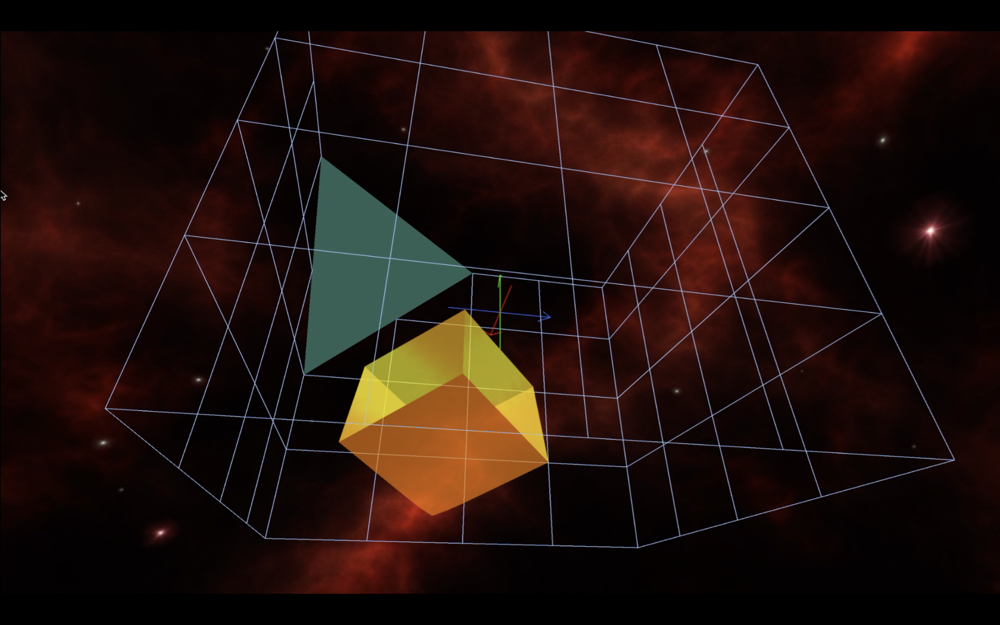

# **USC CSCI 520: Computer Animation and Simulation**  
#### \- taught by Dr. Jernej Barbič  

## **Programming Assignment 1: Simulating a Jello Cube**  

    Operating System: macOS 10.15
    Source Code Editor: Sublime Text, Version 3.2.2, Build 3211
    Programming Language: C++
    API: OpenGL (Compatibility Profile)

### **ASSIGNMENT DETAILS:**
- Look into the file ```Assignment-1-details.pdf```  
                OR
- Go to [](http://barbic.usc.edu/cs520-s20/assign1/index.html)

### **HOW TO EXECUTE THE CODE (For macOS):**
1. Compile using the command: ```make```.  
Note: To delete all the object files and executables:```make clean```
2. To run:  
    - Either type: 
    ```
    ./<your-exe-filename> <world-filename>.w
    ``` 
    - Or type: 
    ```
    ./<your-exe-filename> <world-filename>.w <texture-filename>.ppm
    ```
    Sample:  
    ```
    ./jello jello.w  
    ./jello jello.w textures/texmoon.ppm
    ```  
    Note: The ```<texture-filename>``` is for applying that texture to the inclined plane.  
    IF WE DON'T GIVE TEXTURE FILENAME (eg: ```./jello jello.w```), everything will run fine, only the INCLINED PLANE WON'T HAVE A TEXTURE.

    >The names of the world files you can choose from are:  
    ```jello.w```, ```moveleft.w```, ```rotate.w```, ```gravity.w```, ```skewedCorner.w```  
    The jello in ```jello.w``` can handle reasonable forces from mouse-drag (4th point of implemented extra credit).  
    But the jello in ```moveleft.w``` is more realistic and can only handle very light mouse-drag forces. This jello is mainly defined to show the wiggliness as close to being a real jello cube.  
    The world files that I have tweaked are in the ```project root``` folder and the ones provided with professor's starter code are in the ```world``` folder.
    >  
      
    >The names of the texture files you can choose from are:
    ```texmoon.ppm```, ```texmoon1.ppm```, ```texstone.ppm```, ```texplanet.ppm```
    >

### **FUNCTIONALITY OF EXECUTABLE:**
Keyboard and mouse controls:
- mouse drag: equal force is exerted on all the mass points of jello cube, proportional to the length of mouse drag
- v: switch wireframe/triangle mode
- s: display structural springs on/off
- h: display shear springs on/off
- b: display bend springs on/off
- w: toggle between RED-skybox-with-BLUE-text-and-bounding-box and BLUE-skybox-with-ROSE-COLOR-text-and-bounding-box
- p: pause the cube on/off
- z: camera zoom in
- x: camera zoom out
- right mouse button + move mouse: camera control
- e: reset camera to default position
- space: save the current screen to a file, filename index increments automatically
- ESC: exit application

### **DESCRIPTION(CORE CREDIT ACCOMPLISHMENTS):**
1. **Simulated a jello cube with (8x8x8) mass points as a 3d mass-spring network.**  
Iterated over all the mass points and calculated ELASTIC and DAMPING force on the individual points due to STRUCTURAL, SHEAR and BEND springs around them. Also computed the effect of an EXTERNAL FORCE-FIELD 3D GRID on the jello cube using TRILINEAR INTERPOLATION. Finally calculated the ACCELERATION of every point. Enabled use of either Euler or RK4 INTEGRATOR.

2. **Simulated COLLISION DETECTION with bounding box.**  
When a mass point is on or out of the bounding box, generated a spring (with rest length 0) between the wall and the mass point, normal to the wall. This makes the jello BOUNCE OFF and wiggle away from the wall.

### **ADDITIONAL FEATURES(EXTRA CREDIT CONSIDERATIONS):**
1. **MAKING THE JELLO CUBE(orange-flavoured) REALISTIC -**  
TRANSPARENCY FOR JELLO CUBE: Made the jello cube transparent by changing the ALPHA value of the glColor4 commands specifying the cube color, and by using BLENDING in OpenGL.
COLOR CHANGE FOR JELLO CUBE: Changed the color of jello cube to white and shades of yellow, and orange. Also TWEAKED THE LIGHTING PARAMETERS to affect the coloration, enhance the transparency and shininess of the jello cube.
INCREASED WIGGLINESS OF JELLO CUBE: Manipulated the PHYSICAL PARAMETERS of the jello cube to make it more wiggly yet just enough stable to handle controlled collision forces.

2. **INCLINED PLANE -**  
By just changing the A,B,C,D parameters of the plane, the plane can be placed anywhere within the bounding box. Rendered the polygon generated by PLANE - AABB(Axis-Aligned Bounding Box) INTERSECTION. Applied COLLISION DETECTION between plane and jello cube and response for bouncing off the plane using same technique as for wall-jello cube collisions. Also, by finding out on which side of the plane the cube initially falls (with the help of normals) and compute response so as to keep the jello on that side.

3. **TEXTURE ON INCLINED PLANE -**  
To do IMAGE TEXTURING on the inclined plane, used vertices from Plane-AABB intersection. To convert those 3D vertices to corresponding 2D vertices on the texture image, used rotation matrix for rotation about a 3d axis. Then passed the 2D vertices to OpenGL.

4. **INTERACTIVE ANIMATION OF JELLO CUBE (FORCE BY MOUSE-DRAG) -**  
The user can PUSH THE JELLO CUBE in any direction by dragging mouse. The force exerted is proportional to the length of MOUSE-DRAG. The force is exerted on all the mass points. Have also DISPLAYED THE AXES AT (0,0,0) for ease of understanding mouse-drag direction. The direction is also indicated by a FLASHING WHITE LINE from the world origin in the direction of mouse-drag release point. Kindly be careful while dragging the mouse as a huge force can make the jello cube collapse.

5. **SKYBOX -**  
Hardcoded a skybox to make the space look bigger and more appealing. Implemented image-texturing on sides of the box with normals pointing inwards.

6. **ROTATING DISPLAY OF MY DETAILS -**  
Used PERFORMANCE COUNTER (by Prof. Jernej Barbič) to get TIME ELAPSED between two frames. Printed TEXT in Roman stroke character, ROTATING about it's center, using OpenGL, with the help of this time elapsed. The text is displayed at the back of the bounding box.

7. **CHANGE LOOK OF ENVIRONMENT -**  
By PRESSING 'w' on the keyboard, we can TOGGLE BETWEEN RED-skybox-with-BLUE-text-and-bounding-box and BLUE-skybox-with-ROSE-COLOR-text-and-bounding-box.

### **NECESSARY FILES AND FOLDERS LOCATIONS:**
- The ```world``` folder contains all the _.w_ files.
- The ```textures``` folder contains all the _.ppm_ images used for texturing the inclined plane.
- The ```skybox``` folder contains all the _.ppm_ images used for the skybox.

### **EXHIBIT:**
  
  
  
  
[](https://www.youtube.com/watch?v=6tzOovB9RX0)
